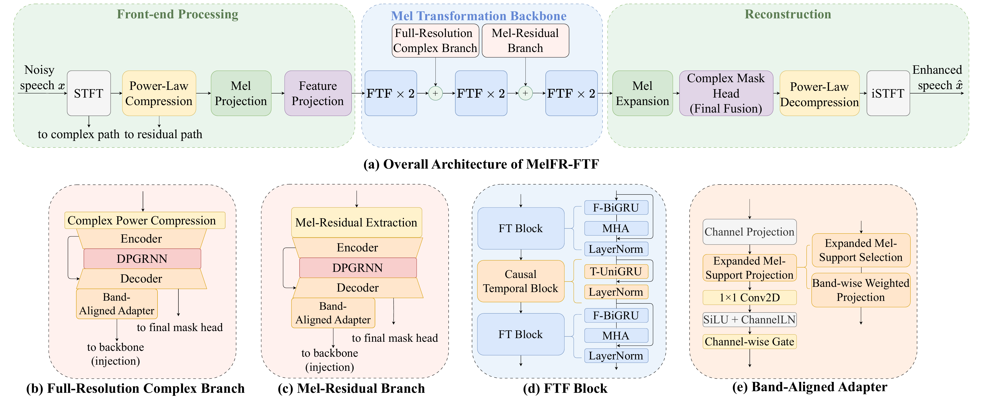

# MelFR-FTF

**Complementary Mel and Full-Resolution Modeling for Lightweight Causal Speech Enhancement**

MelFR-FTF is a lightweight single-channel speech enhancement model. This repository currently provides the project overview and evaluation results.

## Architecture

## Results

| Evaluation | Results |
| --- | --- |
| VoiceBank+DEMAND, standard | PESQ 3.18 · CSIG 4.29 · CBAK 3.63 · COVL 3.76 · STOI 0.945 |
| VoiceBank+DEMAND, FastEnhancer-aligned | P.808 3.48 · SI-SDR 18.9 dB · PESQ 3.18 · STOI 0.945 · eSTOI 0.860 |
| DNS, FastEnhancer-aligned | P.808 3.91 · SIG 3.39 · BAK 4.11 · OVL 3.16 · SCOREQ 0.442 · SI-SDR 16.9 dB · PESQ 2.56 · STOI 0.952 · eSTOI 0.901 |

The model has 69.26K parameters and 399M neural MAC/s, with causal neural processing and 16-ms STFT look-ahead.

Source code and pretrained models will be released only if the paper is accepted.

## Citation

Citation information will be added after publication.
